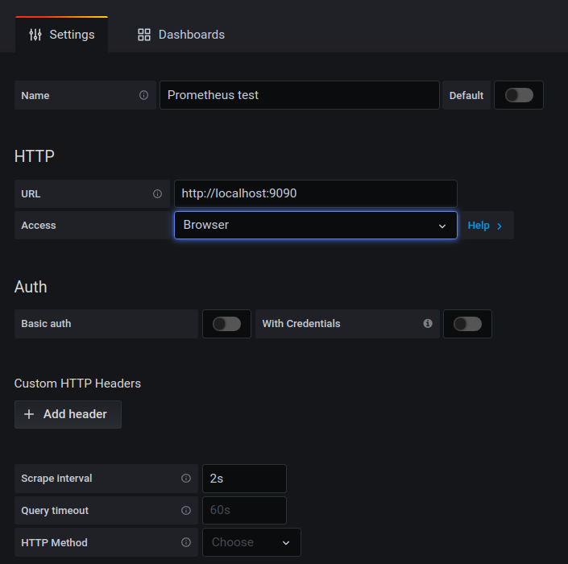
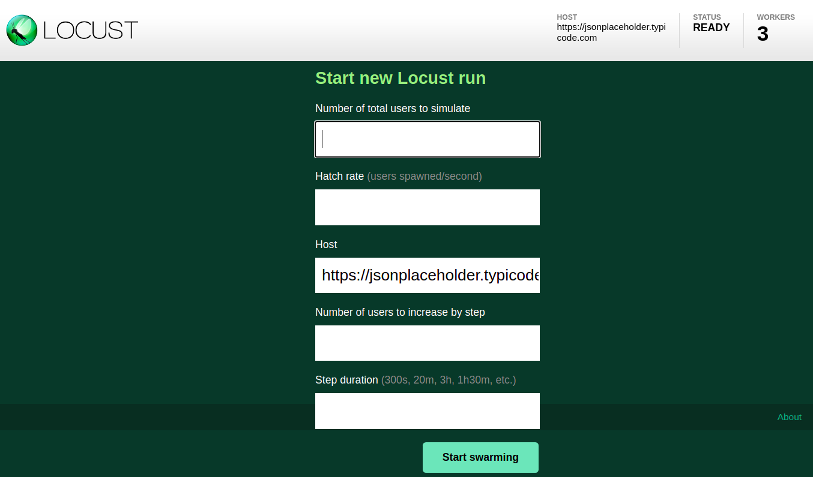

# locust-prometheus-grafana

This is a docker-compose for load testing and monitoring the results.

## Stack:

- [Locust.io](https://locust.io/): the load testing itself.
- [Locust exporter](https://github.com/ContainerSolutions/locust_exporter): exposes test results in a readable format for Prometheus.
- [Prometheus](https://prometheus.io/): scrapes test results and stores it in a timeseries format.
- [Grafana](https://grafana.com/): the tool for representing these results in a graphic way, using Prometheus as database.

## Description

This is a little example of the usage of Locust combined with Prometheus and Grafana. Please, read each tool's documentation for further information.

You can find the *locustfile* inside the *locust* folder. It uses [JSONPlaceholder](https://jsonplaceholder.typicode.com) web as test host. It has one user that simulates three different kind of requests, with different loads for each one.

In this example, Locust is being run distributed, with a master node and the number you want of slave/worker nodes. You can choose the number of workers when running the docker-compose up command (see below).

Locust is also run in Step Load Mode. This enables you to scale the user load, so you can choose how many users are added in each step, and how much time does this step runs.

## Usage

### 1. Clone and docker-compose up

1. Clone the repository: `git clone https://git.paradigmadigital.com/lolabarri/locust-prometheus-grafana.git`.
2. In the root of the project, type on your terminal: `docker-compose up --scale worker=3` (you can change the number of workers).

### 2. Grafana configuration

1. Navigate to http://localhost:3000. The default credentials are admin/admin. You will be prompted to change the password.
2. Go to Configuration/Data Sources (http://localhost:3000/datasources).
3. Click on **Add data source** button. Then select the first option: Prometheus.
4. Important fields (you can leave the rest untouched):
    - Name: write the name for your data source.
    - URL: http://localhost:9090
    - Access: Browser
    - Scrape interval: 2s

5. Click on **Save & Test**.
6. Go to Dashboards and click on **Import**.
7. Upload the dashboards provided in this project folder *grafana*.

### 3. Load testing with Locust

1. Navigate to http://localhost:8089.
2. Tell Locust the number of users you want to simulate, the hatch rate, the number of users to increase by step and the step duration, and click **Start swarming**.

### 4. See the results in Grafana
1. You can see the results of your load testing in real time in the *locust_instant* dashboard provided. The *locust* dashboard is for seeing the results after finishing the testing, adjusting it to the time range you want to see.